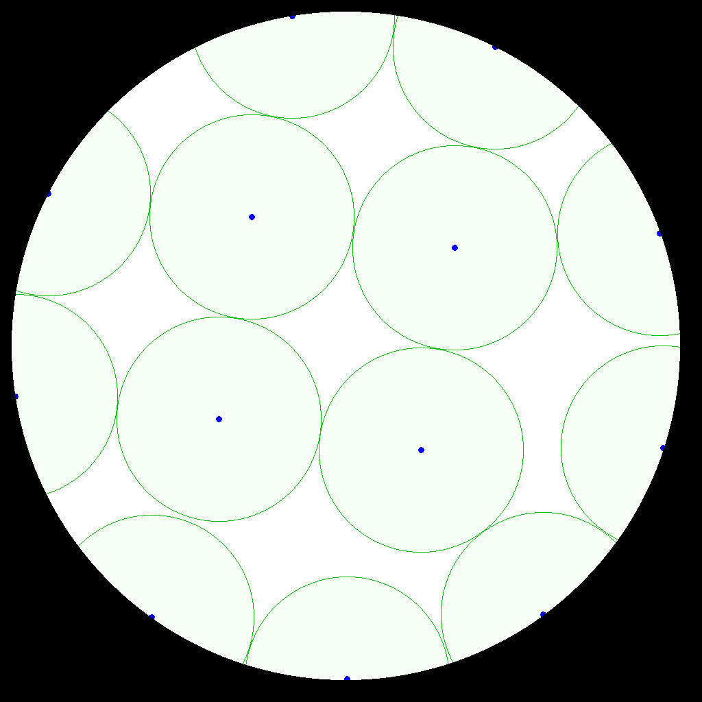
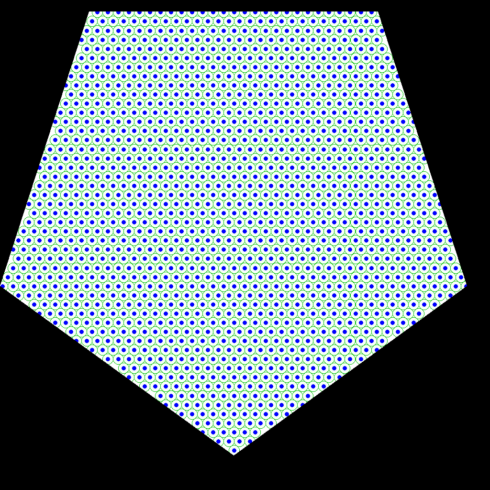
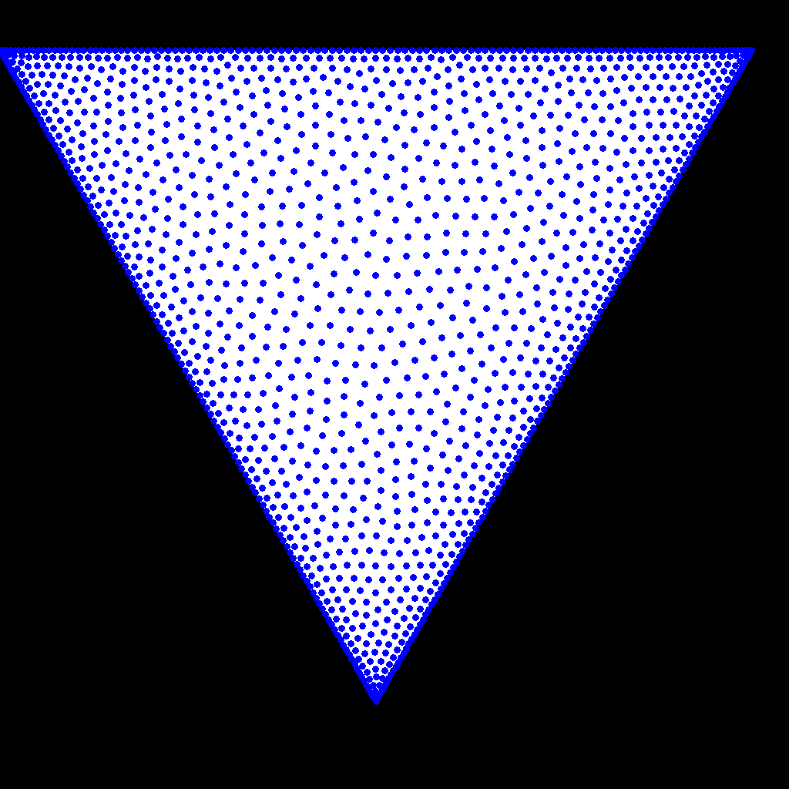

# dragon8

dragon8 is a program that optimizes the distribution of a given number of points within a given shape according to some criteria.

dragon8 is currently in development.

dragon8 is a "zápočtový program" for the Programování 3 class.

#### best packing of n = 13 points inside a circle found by the program

#### distribution of n = 50 points inside a square with lowest energy (~1/r potential) found by the program

#### best packing of n = 1500 points inside a regular pentagon found by the program

#### distribution of n = 1500 points inside an equilateral triangle with lowest energy found by the program

## dependencies

* CImg 2.9.4
  - a header-only image-processing library
  - site: http://cimg.eu/
  - repository: https://github.com/dtschump/CImg
  - v.2.9.4 download: https://github.com/dtschump/CImg/archive/v.2.9.4.zip

## how to compile and run

1. add CImg (see above under dependencies)
    1. unzip the downloaded archive
    2. copy the extracted `CImg.h` file into the `/src` directory inside (a clone of) this repository
2. create a CMake build directory; for example
    1. create a directory in `/build/release`
        * `<repo_dir>$ mkdir -p build/release`
    2. let CMake create the build files from the contents of the `/src` directory
        * `<repo_dir>/build/release$ cmake -DCMAKE_BUILD_TYPE=Release <repo_dir>/src`
    3. hereinafter, we refer to this build directory (here `<repo_dir>/build/release`) as `<build_dir>`
3. let CMake run the compilation
    * `<build_dir>$ cmake --build .`
4. run the generated executable
    * `<build_dir>$ ./dragon8`
    
